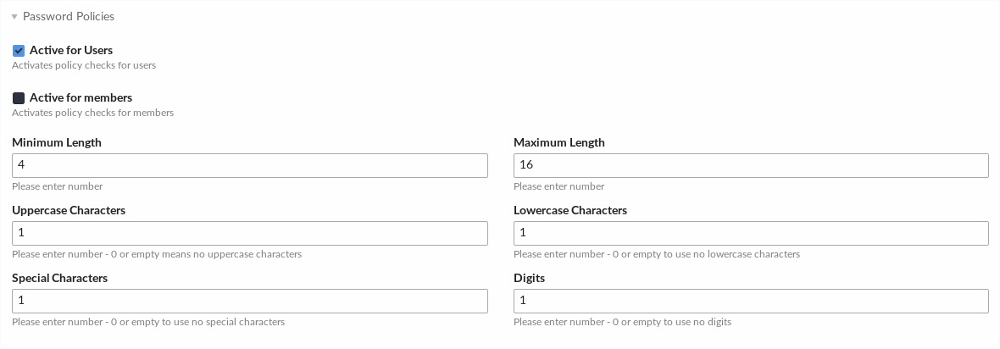

# Password Policy Bundle for Contao Open Source CMS

This bundle allows you to edit your password policy settings for the Contao CMS via Backend.
You can enable the policy rules for either members, users or both.

## Installation

Install the bundle via Composer:

```
composer require eikona-media/contao-password-policy
```

Afterwards clear cache:

```
vendor/bin/contao-console cache:clear --no-warmup
vendor/bin/contao-console cache:warmup
```

Now, go to the Contao settings. There is a new section where you can enable and configure the policy checks for members and/or users.


## Screenshots


